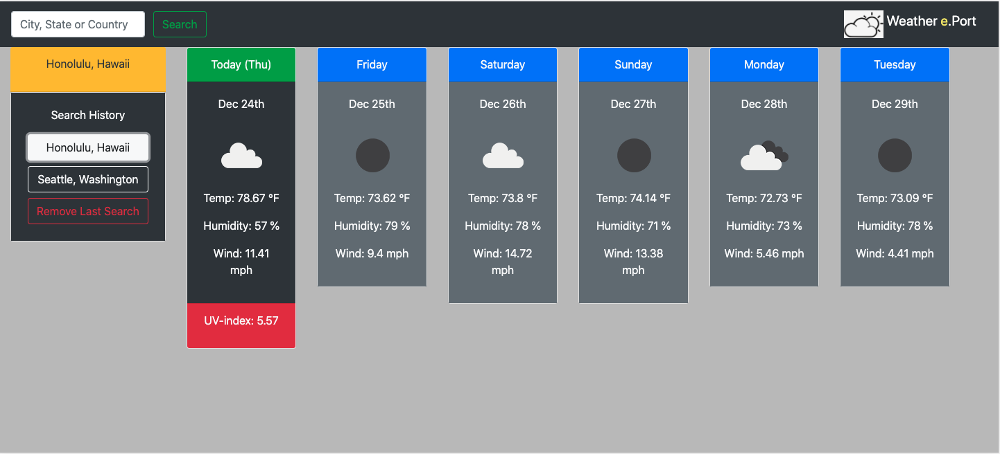
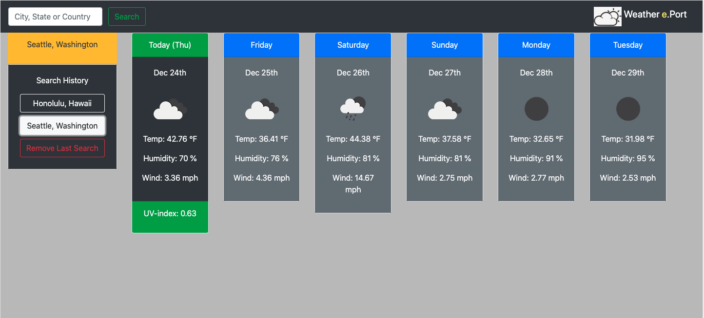
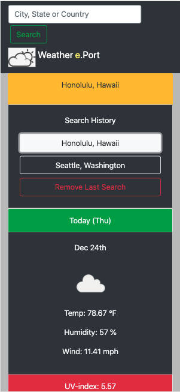
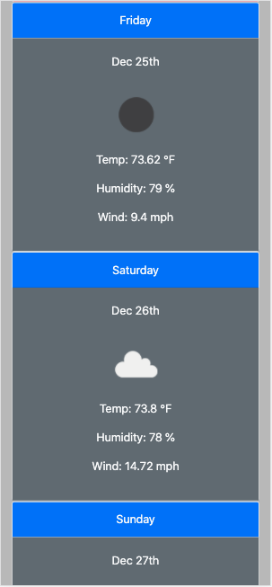

# Weather-e-Port
https://samuelfox1.github.io/Weather-e-Port/

**About the APP**
This app is allows a user to search for a City, State, or Country to explore the weather data hosted on OpenWeatherMap.org.

After searching for a location, the 6 weather cards are auto-populated with the corresponding weather information.

The "Today" card will display the correct date, an icon representing the weather conditions, temperature, humidity, wind speed, and a UV-index rating.
The background color for the UV-Index will change according to the UV intensity.
Colors are: Green - low (0-2)
                Yellow - moderate/high (3-7)
                Red -very high & dangerous (8 and up)

The remaining 5 cards are populated with the projected 5 day weather forecast.
These cards will display the same information of the "Today" card, without the UV-Index data.

Each new searched location will be added the the "Search History" location of the page in the form of a button.
Clicking each location button will display the weather conditions of that location on the page.
If an incorrect search location was entered, it can be removed from the page with the "Remove Last Search" button, found at the bottom of the "Search History" list.

**Background**
This project is a homework assignment to practice working with API calls and how to utilize the data returned from the call. 
The layout of this project is different then the suggested assignment layout to streamline a responsive mobile friendly website.
The trickiest part of the assignment was linking all the correct data from the API returns to the corrcect places on the page.

